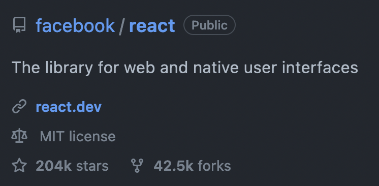
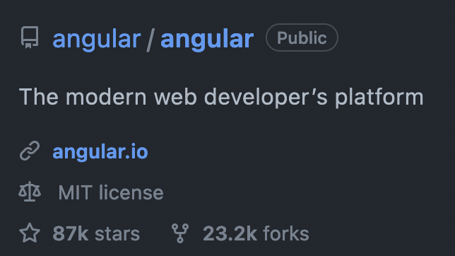
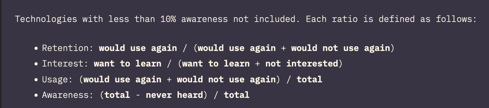
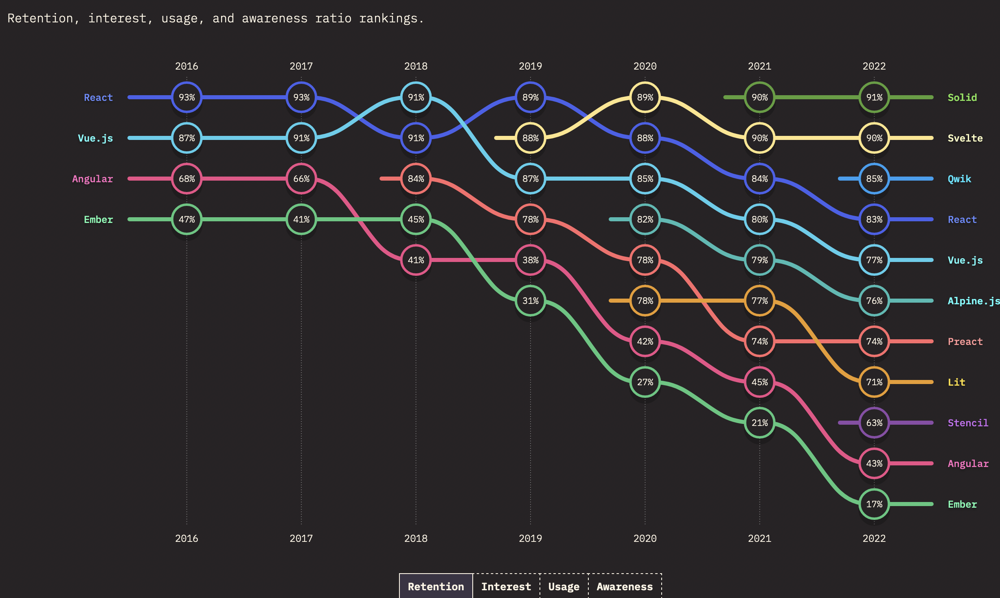
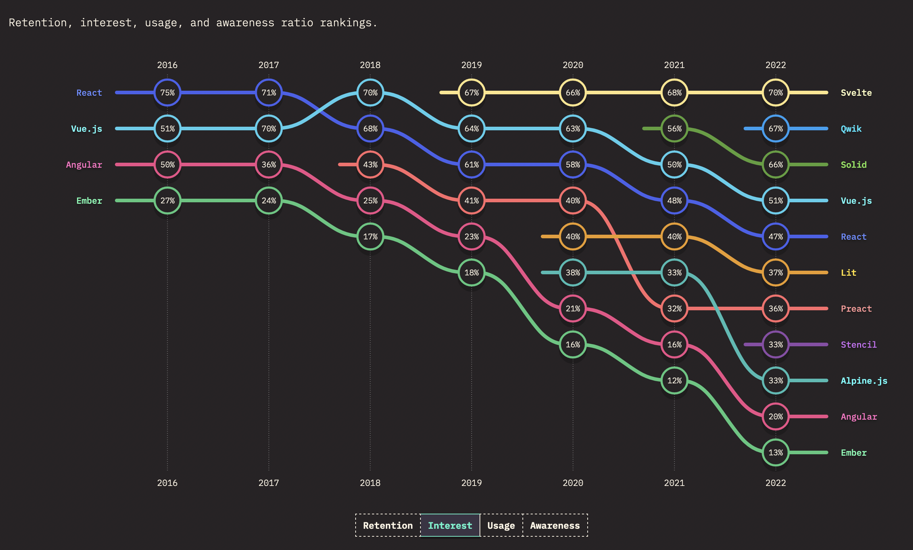
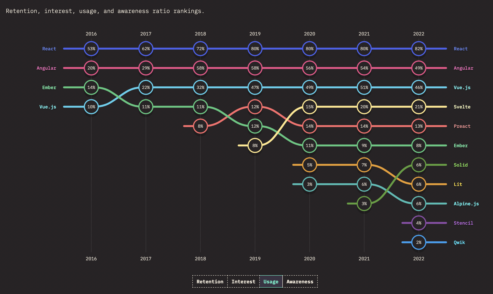

# React Component Spike

## Why React?

A frontend library for building UI components

- Significantly larger pool of applicants
- Frontent state (many options... react-query, React Contexts, Redux, Jotai, Zustand, etc.)
- More community support, the field seems to have "chosen" React at this point in time

### React



### Angular



### Legend



### Retention



### Interest



### Usage



## Why Vite?

A build tool for making javascript applications

### Superior Development Experience

- Dependency pre-bundling
- Native ES modules
- Hot module replacement
- (Show example of changing text in Angular app vs React-Vite app)

### Other Features

- Typescript
- Supports tree-shaking and code splitting
- Bundles for production using rollup (no native ES modules for prod)
- Supports SSR with client side hydration

https://vitejs.dev/guide/features.html

## Bootstrap vs Material UI vs Tailwind

### Bootstrap

Pros:

- Famililar class names

```js
<div className="d-flex justify-content-center align-items-center">
  Styled div
</div>
```

Cons:

- Comes with a set of predefined styles we'll have to selectively change as needed

### Tailwind

Pros:

- Famililar class names

```js
<div className="flex justify-center items-center">Styled div</div>
```

- Unopinionated
- Extremely fast to work with

Cons:

- Everything from scratch
- Long strings of class names
-

### Material UI

Pros:

- Theme providers can be used to standardize styling and expidite development
- Elegant styled API for created styled components

```js
import React from "react";
import { styled } from "@mui/system";

const StyledDiv = styled.div`
  display: "flex";
  justify-content: "center";
  align-items: "center";
`;

export default function StyledDivExample() {
  return <StyledDiv>Styled div</StyledDiv>;
}
```

Cons:

- Huge bundle size
- If we don't commit to the Material UI design pattern we will be fighting it every step of the way
- Duplicate styled components can get out of hand

### Final Thoughts

The question is essentially, what level of customizability to do we want? The levels are pretty clear to me:

- Full customizability without an opinionated start (Tailwind)
- Customizability with an opinionated start (Bootstrap)
- Commit to someone else's design patterns (Material UI)

I don't think any of these are bad options. We don't need to be creating a completely unique website without the design patterns and opinions of someone else. But if that is what we are trying to do, Tailwind of Bootstrap would be the choices.
